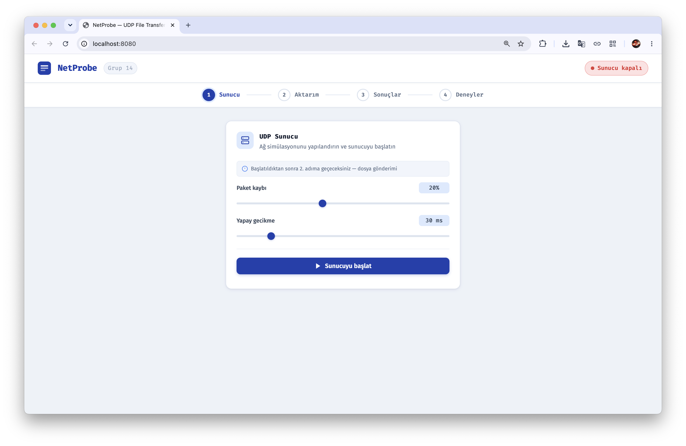
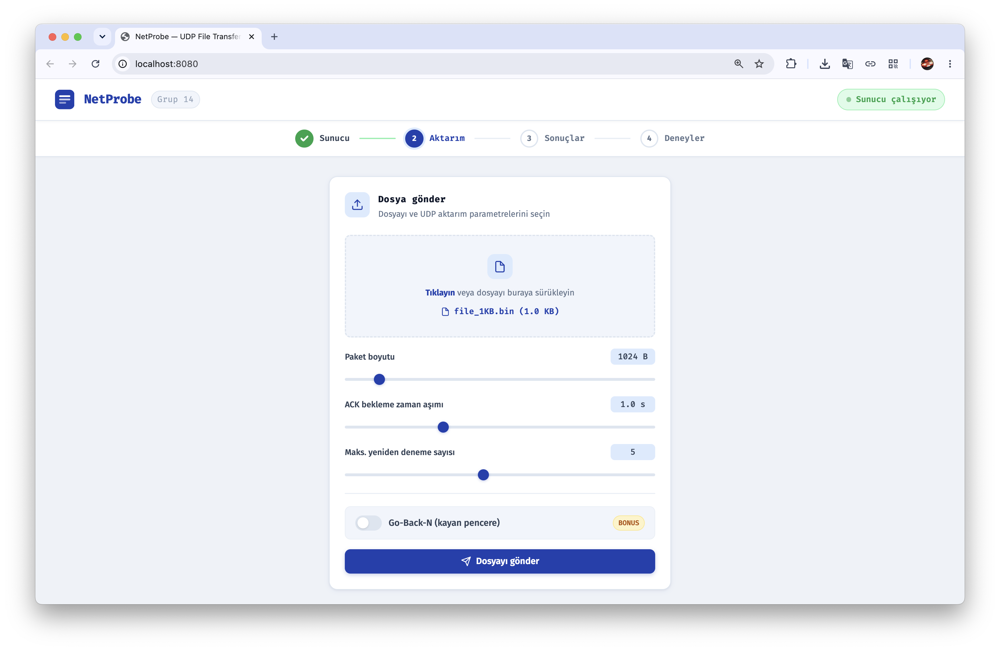
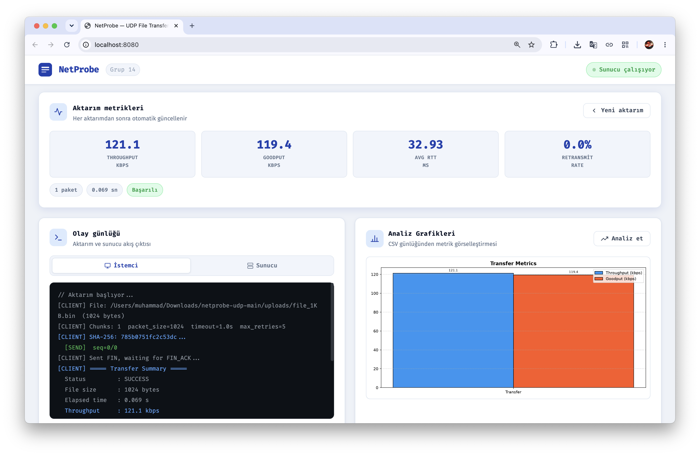
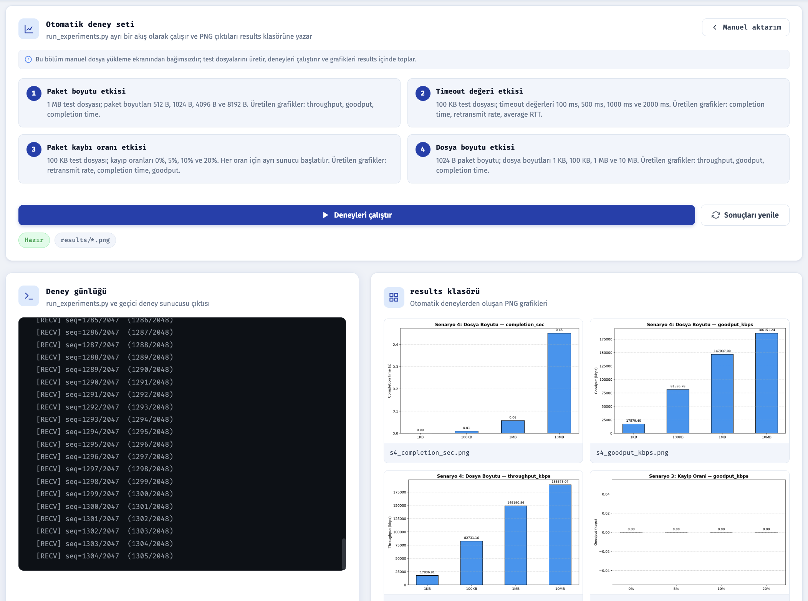

# NetProbe

**UDP Tabanlı Güvenilir Dosya Aktarımı, Trafik İzleme ve Ağ Performans Analiz Platformu**

Bursa Teknik Üniversitesi — Bilgisayar Ağları Dönem Projesi

GitHub bağlantısı: https://github.com/OrtakLab/netprobe-udp

---

## Proje Yapısı

```
netprobe/
├── src/
│   ├── protocol.py        # Paket yapısı ve serializasyon (CRC32)
│   ├── server.py          # UDP sunucu
│   ├── client.py          # Stop-and-Wait UDP istemci
│   ├── sliding_window.py  # Go-Back-N sliding window istemci (bonus)
│   ├── network_sim.py     # Kayıp / gecikme simülatörü
│   ├── logger.py          # CSV event logger
│   └── analyzer.py        # Performans metrikleri ve grafik üretimi
├── static/
│   ├── index.html         # Web arayüzü
│   └── style.css
├── logs/                  # Otomatik oluşturulan CSV loglar
├── results/               # Grafik çıktıları (PNG)
├── test_files/            # Test dosyaları (run_experiments.py tarafından üretilir)
├── uploads/               # Web arayüzünden yüklenen dosyalar ve rapor PDF'leri
├── web_app.py             # Flask web arayüzü backend (port 8080)
├── run_experiments.py     # Tüm deney senaryolarını otomatik çalıştırır
└── requirements.txt
```

---

## Kurulum

```bash
pip install -r requirements.txt
```

Python 3.10+ gereklidir.

---

## Hızlı Başlangıç

### Seçenek A — Web Arayüzü (Önerilen)

```bash
python web_app.py
```

Tarayıcıda `http://localhost:8080` adresine gidin. Arayüz üzerinden sunucuyu başlatabilir, dosya gönderebilir ve sonuçları analiz edebilirsiniz.

---

### Seçenek B — Komut Satırı

#### 1 — Sunucuyu başlat (Terminal 1)

```bash
python src/server.py --port 5001
```

#### 2 — Dosya gönder (Terminal 2)

```bash
python src/client.py --file test_files/file_1MB.bin ^
    --host 127.0.0.1 --port 5001 ^
    --packet-size 1024 --timeout 1.0 --max-retries 5
```

#### 3 — Performans analizi

```bash
python src/analyzer.py --log logs/transfer_client_<timestamp>.csv ^
    --file-size 1048576 --output results/
```

> **Not:** Tüm betikler `netprobe/` kök dizininden çalıştırılmalıdır (`src/` içinden değil).

---

## Tüm Parametreler

### server.py

| Parametre | Varsayılan | Açıklama |
|-----------|-----------|---------|
| `--port` | 5001 | UDP port |
| `--output-dir` | received | Alınan dosyaların kaydedileceği klasör |
| `--loss-rate` | 0.0 | Yapay paket kayıp oranı [0, 1) |
| `--delay` | 0.0 | Yapay gecikme (ms) |
| `--log-dir` | logs | Log klasörü |
| `--label` | "" | Log dosyası etiketi |
| `--idle-timeout` | 8.0 | Yarım kalan aktarımı `.partial` olarak kaydetmeden önce beklenecek süre |

### client.py (Stop-and-Wait)

| Parametre | Varsayılan | Açıklama |
|-----------|-----------|---------|
| `--file` | — | Gönderilecek dosya (zorunlu) |
| `--host` | 127.0.0.1 | Sunucu IP |
| `--port` | 5001 | Sunucu portu |
| `--packet-size` | 1024 | Paket payload boyutu (byte) |
| `--timeout` | 1.0 | ACK timeout süresi (saniye) |
| `--max-retries` | 5 | Maksimum yeniden gönderim sayısı |
| `--log-dir` | logs | Log klasörü |
| `--label` | "" | Log dosyası etiketi |

### sliding_window.py (Go-Back-N, bonus)

`client.py` parametrelerine ek olarak:

| Parametre | Varsayılan | Açıklama |
|-----------|-----------|---------|
| `--window-size` | 4 | Pencere boyutu |

---

## Deney Senaryoları

> Aşağıdaki komutlar PowerShell içindir. Her senaryo için önce sunucuyu başlatın, ardından istemciyi çalıştırın.

### Senaryo 1 — Paket Boyutunun Etkisi

```powershell
# Terminal 1
python src/server.py --port 5001

# Terminal 2
foreach ($pkt in @(512, 1024, 4096, 8192)) {
    python src/client.py --file test_files/file_1MB.bin `
        --packet-size $pkt --label "s1_pkt$pkt"
}
```

### Senaryo 2 — Timeout Değerinin Etkisi

```powershell
foreach ($to in @(0.1, 0.5, 1.0, 2.0)) {
    python src/client.py --file test_files/file_100KB.bin `
        --timeout $to --label "s2_to$($to -replace '\.','')s"
}
```

### Senaryo 3 — Kayıp Oranının Etkisi

```powershell
# Her kayıp oranı için sunucuyu yeniden başlatın:
python src/server.py --loss-rate 0.05 --label s3_loss5
# Ardından istemciyi --label s3_loss5 ile çalıştırın
```

### Senaryo 4 — Dosya Boyutunun Etkisi

```powershell
foreach ($f in @("1KB", "100KB", "1MB", "10MB")) {
    python src/client.py --file "test_files/file_$f.bin" `
        --packet-size 1024 --label "s4_$f"
}
```

### Tüm senaryoları otomatik çalıştır

```bash
python run_experiments.py --port 5001
```

> Not: 1, 2 ve 4. senaryolar için `--port` üzerinde normal sunucu çalışıyor olmalıdır. 3. senaryo, kayıp oranlarını çakışma olmadan test etmek için otomatik olarak bir sonraki portu kullanır (`--port 5001` verilirse `5002`).

---

## Protokol

### Veri Paketi (big-endian)

```
| type(1B) | seq_num(4B) | total_pkts(4B) | payload_len(2B) | CRC32(4B) | payload |
```

### ACK Paketi

```
| type(1B) | ack_num(4B) | CRC32(4B) |
```

| Tür | Değer |
|-----|-------|
| DATA | 0x01 |
| ACK | 0x02 |
| FIN | 0x03 |
| FIN_ACK | 0x04 |

Bütünlük kontrolü: CRC32 her pakette, SHA-256 hash FIN paketinde gönderilir.

---

## Log Formatı

`logs/transfer_<label>_<timestamp>.csv`

| Sütun | Açıklama |
|-------|---------|
| timestamp | `time.perf_counter()` değeri (saniye) |
| event | Olay türü (aşağıya bakın) |
| seq_num | Paket sıra numarası |
| detail | Ek bilgi (örn. `attempt=2`) |

| Olay | Açıklama |
|------|---------|
| SEND | Paket gönderildi |
| ACK_RECV | ACK alındı |
| TIMEOUT | ACK zaman aşımı |
| RETRANSMIT | Paket yeniden gönderildi |
| DROP_SIM | Sunucu tarafından simüle edilen kayıp |
| DUPLICATE | Yinelenen paket atıldı |
| RECV | Sunucu paketi aldı |
| TRANSFER_DONE | Aktarım tamamlandı |
| TRANSFER_FAIL | Aktarım başarısız (max deneme aşıldı) |
| INTEGRITY_OK | SHA-256 doğrulaması geçti |
| INTEGRITY_FAIL | SHA-256 doğrulaması başarısız |

---

## Web Arayüzü Ekran Görüntüleri

Web arayüzü; UDP dosya aktarım sürecini kolayca yönetmenizi, ağ gecikmelerini/kayıplarını dinamik olarak simüle etmenizi ve aktarım sonrasında oluşan performans metriklerini grafiklerle canlı olarak incelemenizi sağlar.

### 1. UDP Sunucu Yapılandırması (Adım 1)
Yapay paket kaybı ve gecikme (delay) parametrelerini belirleyerek UDP sunucusunu tek tıkla başlatabilirsiniz.



### 2. Güvenilir Dosya Gönderimi (Adım 2)
Gönderilecek dosyayı sürükle-bırak yöntemiyle seçebilir; paket boyutu, ACK zaman aşımı ve maksimum yeniden deneme limitlerini belirleyebilirsiniz. Ayrıca **Go-Back-N (kayan pencere)** protokolünü ve pencere boyutunu aktif hale getirebilirsiniz.



### 3. Aktarım Metrikleri ve Canlı Analiz (Adım 3)
Aktarım tamamlandığında Throughput (kbps), Goodput (kbps), ortalama RTT (ms) ve paket yeniden iletim oranları (Retransmit Rate) anlık olarak hesaplanır. **"Analiz et"** butonuyla Throughput ve Goodput değerlerini karşılaştıran grafikler dinamik olarak çizilir.



### 4. Otomatik Deney Seti (Adım 4)
Farklı paket boyutları, timeout değerleri, kayıp oranları ve dosya boyutlarının performans üzerindeki etkilerini incelemek için otomatik deney senaryolarını tek tuşla koşturabilir, üretilen grafikleri anlık olarak arayüzde görebilirsiniz.



---

## Bağımlılıklar

- Python standart kütüphanesi: `socket`, `struct`, `zlib`, `hashlib`, `threading`, `csv`, `time`
- Dış kütüphaneler: `matplotlib`, `pandas` (analiz için), `flask` (web arayüzü için)
